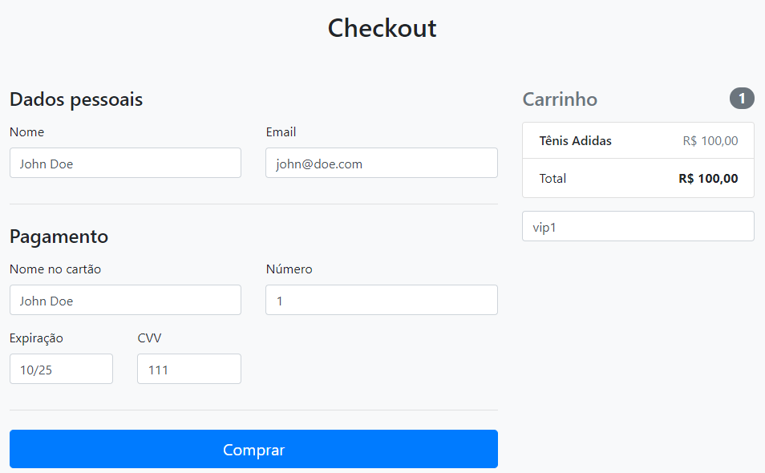
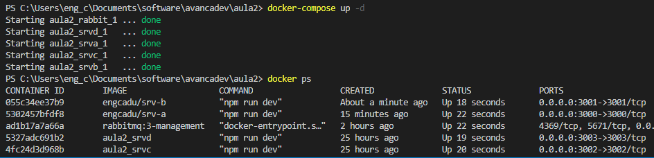
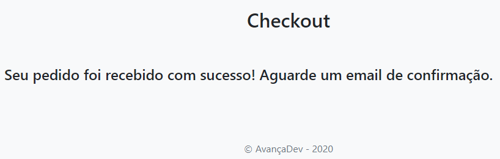
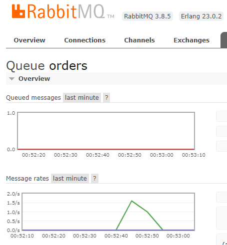
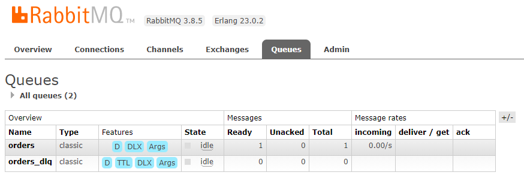

# Semana Avança Dev

Implementação das aulas e desafios feitos durante a Semana Avança Dev realizada por Wesley Willians.

## Desafio 1

O primeiro desafio consiste em, dado que existem 3 microserviços comunicando-se entre si (srv-a, srv-b e srv-c), adicionar um quarto (srv-d) e fazer com que o srv-c se comunique com ele.

## Desafio 2

Modificar a implementação do Desafio 1 para que a comunicação entre o srv-a e srv-b ocorra através do RabbitMQ. O srv-a deverá publicar mensagens para o RabbitMQ e, por sua vez, o srv-b deverá consumí-las.

## Desafio 3

Gerar imagens Docker para os microserviços do Desafio 2 e subí-las para o Docker Hub. Além disso, criar um docker-compose.yaml para subir todos os microserviços, inclusive o RabbitMQ.

## Authors

* **Lucas Vasconcelos** - *eng_cadu@hotmail.com*